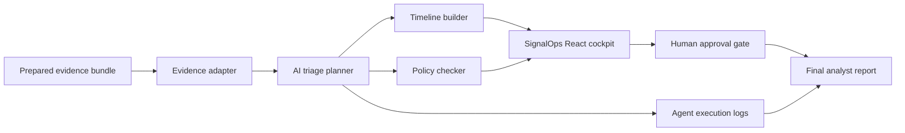

# SignalOps FIND EVIL Submission Pack

## Submission Positioning

SignalOps is a defensive incident triage cockpit for AI-assisted evidence review. The project focuses on making an analyst faster without letting an autonomous system take destructive action.

For FIND EVIL, the strongest version is:

> An agentic triage assistant that ingests forensic or incident evidence, builds a confidence-scored timeline, records its reasoning trail, and keeps remediation behind explicit human approval.

## Why This Fits

- FIND EVIL rewards useful AI workflows for defensive investigation and response.
- SignalOps already has the core UX: queue, evidence map, timeline, policy checks, approval state, and audit logs.
- The prototype can be extended with a small backend adapter that reads prepared incident evidence instead of relying only on local sample data.
- The demo can show a complete investigation path without touching real third-party systems or running unsafe actions.

## Architecture

## Minimum Credible Build

1. Add a public `examples/find-evil/` evidence bundle with sanitized log snippets, repository events, timestamps, and expected findings.
2. Add a small parser that converts the bundle into SignalOps incident records.
3. Add an agent execution log export with each step, input summary, output summary, and confidence score.
4. Add an accuracy report comparing expected findings against the agent-generated timeline.
5. Add a demo mode in the UI that loads the FIND EVIL incident and shows the full triage path.

## Submission Assets

- Public repository: https://github.com/iice257/signalops
- Live demo: https://signalops-orpin.vercel.app
- Prepared evidence bundle: `public/examples/find-evil/evidence.json`
- Demo video: 3 to 5 minutes
- Architecture diagram: the flow above or a polished PNG version
- Dataset documentation: evidence source, schema, sanitization note, expected findings
- Accuracy report: true findings, missed findings, false positives, confidence notes
- Agent execution logs: timestamped steps from evidence ingestion to final report
- License: add MIT or Apache-2.0 if the competition requires an open-source license

## Demo Script

1. Open the SignalOps cockpit and choose the FIND EVIL incident.
2. Show the evidence bundle sources and explain that they are prepared defensive data.
3. Run triage and show the agent moving from collection to hypothesis to policy checks.
4. Open the evidence map and timeline to show why the incident was ranked high.
5. Show the accuracy report and execution log.
6. Approve the guarded recommendation to demonstrate the human gate.
7. Close with the live demo, repository, and what would be connected next.

## Guardrails

- Use only prepared, owned, or public challenge data.
- Do not scan, attack, brute force, exploit, or access any third-party system.
- Do not include secrets, tokens, customer data, or personal data in examples.
- Keep all risky actions in the UI as simulated approval states unless the target environment is explicitly owned and isolated.

## Implemented Slice

- The React incident queue includes a `FE-001` FIND EVIL demo incident.
- The inspector shows the evidence packet, expected findings, and accuracy counts.
- The public bundle is served from `/examples/find-evil/evidence.json`.

## Next Implementation Slice

The next code slice should add a deterministic parser that reads the JSON bundle at runtime and maps it into SignalOps incident records. The current implementation keeps the record in the UI data module so the demo stays dependency-light and reliable.
